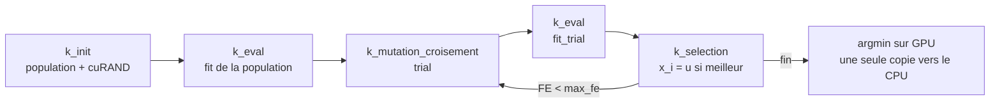

# Correspondance PSO → DE (tâche 1.5)

Pour chaque élément du code PSO du prof : ce qu'il devient dans notre DE/rand/1/bin.

## L'algorithme en une ligne

| | PSO | DE/rand/1/bin |
|---|---|---|
| Idée | chaque particule se déplace vers son meilleur passé et vers le meilleur de l'essaim | chaque individu est comparé à un « essai » fabriqué à partir de 3 autres individus pris au hasard |
| Mémoire | position, vitesse, meilleur personnel (3 tableaux N×D) | population + essais (2 tableaux N×D), fitness (N) |

## Élément par élément

| PSO (code du prof) | DE (notre code) | Remarque |
|---|---|---|
| `positions` initialisées par `getRandom` | population initialisée uniformément dans `[lower_bound(f), upper_bound(f)]` | même idée, bornes corrigées (bugs 3 et 5) |
| `velocities` | **n'existe pas** | le DE n'a pas de vitesse |
| `pBests` | **la population elle-même** | la sélection garde toujours le meilleur de (cible, essai) à chaque indice : chaque case de la population joue le rôle d'un « meilleur personnel » |
| `gBest` | meilleur individu (argmin de `fit`) | inutile pour faire évoluer DE/rand/1, utile seulement pour le résultat final et les variantes type current-to-best (étape 7) |
| `OMEGA`, `c1`, `c2` | `F = 0.5` (échelle de mutation), `CR = 0.3` (taux de croisement) | valeurs de l'article |
| `r1`, `r2` tirés **une fois par itération** sur le CPU | pour **chaque individu** : 3 indices `r1 ≠ r2 ≠ r3 ≠ i` ; pour **chaque gène** : un nombre `rand_j` ; un indice `jrand` | tirés sur le GPU avec **cuRAND** (bug 13) |
| `kernelUpdateParticle` : `v = ωv + c1 r1 (pBest − x) + c2 r2 (gBest − x)`, `x += v` | **mutation** : `v = x_r1 + F (x_r2 − x_r3)` puis **croisement binomial** : `u_j = v_j` si `rand_j ≤ CR` ou `j = jrand`, sinon `x_j` | produit un vecteur **d'essai** `u`, sans toucher à la population |
| `fitness_function` (GPU) + `host_fitness_function` (CPU) | **une seule** `evaluate(f, x, o, D)` marquée `__host__ __device__` | fin des deux copies (interface commune, issue #5) |
| `kernelUpdatePBest` : si `f(x) < f(pBest)`, `pBest ← x` | **sélection** : si `f(u) ≤ f(x_i)`, `x_i ← u` et `fit_i ← f(u)` | `≤` et non `<` : on accepte un essai aussi bon, ce qui aide à traverser les plateaux |
| `tempParticle1/2` globaux partagés | **supprimés** : chaque thread lit directement ses données ou utilise sa propre mémoire | bug 1 (race condition) |
| boucle CPU de recherche du gBest + 2 `cudaMemcpy` par itération | **rien dans la boucle** ; une réduction argmin sur GPU à la fin (ou pour la courbe de convergence) | bug 10, 42 % du temps du PSO (tâche 1.3) |
| `MAX_ITER = 10^4 × D` itérations | budget `max_fe(D) = 10^4 × D` **évaluations** ; générations = (max_fe − N) / N | bug 7 |
| `NUM_OF_DIMENSIONS`, `NUM_OF_PARTICLES` constantes de compilation | `D` et `N` lus sur la ligne de commande : `./prog <func> <D> <N> <seed>` | bug 8 |
| `printf("%f", f(gBest))` | une ligne CSV : `algo,func,D,N,seed,best_error,time_s,FE` avec l'erreur en notation scientifique | bug 9 et format commun |
| `clock()` | `std::chrono` (séquentiel), `cudaEvent` (GPU) | bug 14 |

## Le point subtil : essais et population dans deux tableaux séparés

Dans le PSO, chaque particule ne lit que **ses propres** données (et gBest) : on peut la mettre à jour sur place.

Dans le DE, l'individu `i` lit **trois autres individus** `r1, r2, r3` pour fabriquer son essai. Si un thread remplaçait `x_i` pendant qu'un autre thread lit encore `x_i` comme `x_r1`, les deux ne travailleraient pas sur la même génération : le résultat dépendrait de l'ordre d'exécution des threads (encore une race condition).

**Règle :** pendant une génération, on **lit** uniquement la population courante et on **écrit** les essais dans un tableau séparé `trial`. La sélection n'a lieu qu'**après**, quand tous les essais sont prêts. Sur GPU, la séparation en kernels successifs le garantit naturellement : un kernel ne commence qu'une fois le précédent terminé.

## Découpage en kernels prévu (version v1, étape 3)

