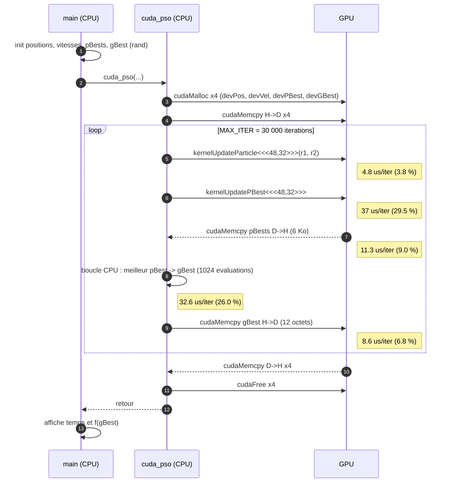

# Diagramme de séquence du PSO original (tâche 1.4)

Source : `docs/uml/sequence_pso.mmd` · Image pour l'article : `docs/uml/sequence_pso.png`.
Temps par itération mesurés à la tâche 1.3 (GPU T4, Levy 3D, N = 512, 30 000 itérations).

## Lecture

- Les flèches 3, 4, 10 et 11 ne sont exécutées **qu'une fois** : allocation, copie initiale, copie finale, libération.
- Dans la boucle, **3 flèches sur 5 traversent le bus PCIe ou restent sur le CPU** (7, 8, 9) : c'est 42 % du temps mesuré, sans aucun calcul GPU.
- La flèche 8 est **séquentielle** : le CPU évalue 1024 fois la fonction pendant que le GPU attend.
- Ce que le DE GPU doit supprimer : les flèches 7, 8 et 9. Toute la boucle reste sur le GPU, et le meilleur individu est obtenu par une réduction parallèle.
